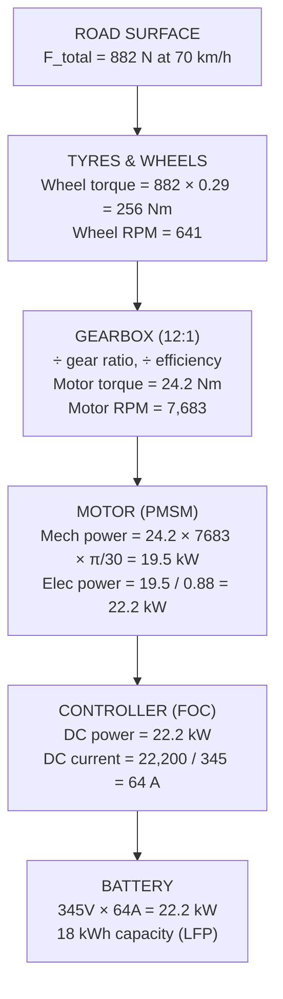

# How to Size an Electric Vehicle Powertrain — A Practical Guide

*A step-by-step walkthrough of motor and controller sizing for an electric vehicle.*

---

### Why this guide?

There are plenty of lectures, textbooks, and tutorials that walk you through the physics and formulae of EV powertrain sizing. They derive the equations, plug in some numbers, and arrive at a motor spec. But I always found that something was missing — the connection to a real vehicle and real engineering decisions.

Deciding the powertrain of a vehicle is not just about physics-based calculations. It is about understanding what the constraints mean, why certain scenarios are harder than others, and what trade-offs you are making when you pick one number over another. Why do we size torque from hill climbing and power from acceleration? Why not the other way around? What happens if we change the gear ratio? Why does the first-pass result always come out oversized?

Through this guide, I have tried to capture not just the calculations but the reasoning behind them — the constraints and the meaning behind those constraints. I have kept the terminology simple and explained each step, not just focusing on *how* to calculate, but mainly *why* we calculate it that way.

**A note on scope:** This is an approximation-based calculation guide — useful for quick first-pass estimations, especially when you are in the early stages of a project and many vehicle parameters are still unknown or uncertain. The approach uses simplified models (constant efficiency, duration-based thermal ratings, independent worst-case sizing) that get you to a defensible motor specification without needing detailed motor data. As your project matures and you have access to real motor parameters (winding resistance, inductance, flux linkage), measured performance curves (efficiency maps, thermal limit envelopes), and target drive cycles (IDC, MIDC, WLTP), you would want to move to more advanced modelling techniques that we will cover in separate articles.

The guide uses a small 3-seater Indian city EV as a worked example. Every formula is applied to real numbers from a companion **[Excel spreadsheet](/blog/assets/motor_sizing_calculations_simplified.xlsx)** that you can download and modify for your own vehicle.

### What this guide covers

1. **The Big Picture** — Why torque and power are sized from different scenarios, and the forces your motor fights
2. **Torque-Limiting vs Power-Limiting** — The two operating regimes and how the gear ratio connects them
3. **The Actual Calculations** — Step-by-step sizing: gradeability (torque), thermal derating, acceleration (power), base speed, field weakening, and verification
4. **What We Skipped** — Regenerative braking, multi-speed gearboxes, and other real-world factors
5. **Motor & Controller Basics** — What the datasheet numbers actually mean
6. **Electrical Equivalence** — How voltage, current, RPM, and torque relate through the controller
7. **Designing for Real-World Usage** — Choosing the right base speed for your driving profile
8. **Finding Motor Parameters** — Practical advice for working with supplier datasheets
9. **The Oversizing Problem** — Why your first-pass motor is always too big, and how to iterate toward the right size

### TL;DR

An EV motor must handle two very different jobs: climbing hills (high torque at low speed) and accelerating on flat roads (high power at high speed). You size for each independently — hills set the torque requirement, acceleration sets the power requirement — then combine the worst case of each into a single motor spec. The gear ratio acts as a lever between motor torque and wheel force, and the base speed (where the motor transitions from constant torque to constant power) is a natural consequence of the torque-to-power ratio you've chosen. The first-pass result is always deliberately oversized because the two scenarios are sized independently and then combined with safety margins. This conservative estimate gets you a spec that's safe to send to suppliers; the iteration toward a right-sized motor happens later with real hardware data.

---

## Part 1: The Big Picture — What Are We Actually Solving?

### The core question

You're building an electric vehicle. You need a motor. But... **how powerful should it be?**

Too small → your vehicle can't climb hills or accelerate safely.
Too big → you're wasting money, weight, and space.

The answer comes from asking: **what's the hardest thing this vehicle will ever need to do?**

### The two hardest jobs for your motor

Every EV motor faces two very different challenges:

| | Job 1: Climbing a Hill | Job 2: Accelerating |
|---|---|---|
| **Speed** | Slow (5 km/h) | Fast (0→70 km/h) |
| **Force needed** | Enormous (fighting gravity!) | Moderate, but at high speed |
| **Duration** | Minutes (sustained effort) | Seconds (burst effort) |
| **Motor RPM** | Low (~550 RPM) | High (~7,700 RPM) |
| **What it demands** | HIGH TORQUE | HIGH POWER |

Here's the key insight:

> **Torque** is how hard the motor pushes.
> **Power** is how fast it pushes hard.
> The relationship: **Power = Torque × RPM**

Think of it like cycling. Climbing a steep hill in low gear means your legs push hard but slowly — that's high torque, low RPM. Pedalling fast on a flat road means your legs push moderately but spin very quickly — that's high power (moderate torque × high RPM).

### Our example vehicle

Throughout this guide, we'll size the powertrain for a small 2-seater electric vehicle with the following specifications:

| Spec | Value | Notes |
|------|-------|-------|
| Curb weight (no passengers) | 619 kg | Vehicle structure, battery, motor |
| Full weight (GVW) | 844 kg | Curb + 3 × 75 kg (driver + 2 passengers) |
| Top speed | 70 km/h | Low-speed urban vehicle |
| Battery | 345V, 18 kWh LFP | Lithium Iron Phosphate chemistry |
| Wheel radius (r) | 0.29 m | Including tyre |
| Gear ratio (G) | 12:1 | Single-speed reduction gearbox |
| Frontal area (Af) | 1.70 m² | 1.2m wide × 1.42m effective height |
| Drivetrain efficiency (η) | 88% | Combined motor + gearbox losses |

---

## Part 2: The Approach — Torque-Limiting vs Power-Limiting

### Forces acting on a vehicle

Before we calculate anything, let's understand what the motor is fighting against. Every time the vehicle moves, it faces resistances:

| Force | What it is | Formula | Example |
|-------|-----------|---------|---------|
| **Rolling Resistance** | Tyres deforming against the road surface. Always present, roughly constant regardless of speed. | F_roll = Crr × m × g | 0.015 × 844 × 9.81 = **124 N** |
| **Aerodynamic Drag** | Air pushing back against the vehicle. Gets worse with speed *squared* — double the speed, quadruple the drag. | F_aero = 0.5 × ρ × Cd × Af × v² | At 40 km/h: **45 N**, at 70 km/h: **138 N** |
| **Gravity (Grade)** | Only when climbing hills. Dominates everything else on steep slopes. | F_grade = m × g × sin(θ) | 10° slope: **1,441 N**, 15° slope: **2,142 N** |
| **Acceleration** | Newton's second law — force needed to change velocity. | F_accel = m × a | 694 kg × 1.85 m/s² = **1,284 N** |

> **Variables used above:**
> - **Crr** = Coefficient of rolling resistance (dimensionless, typically 0.01–0.02 for car tyres on tarmac; we use 0.015)
> - **m** = Vehicle mass in kg (varies by scenario — 844 kg full load for hills, 694 kg driver-only for acceleration)
> - **g** = Acceleration due to gravity = 9.81 m/s²
> - **ρ** (rho) = Air density = 1.225 kg/m³ (at sea level, 15°C)
> - **Cd** = Coefficient of drag (dimensionless, shape-dependent; we use 0.35 — typical for a small boxy vehicle)
> - **Af** = Frontal area of the vehicle in m² (the cross-section the air "sees" — width × effective height)
> - **v** = Vehicle speed in m/s (to convert km/h to m/s, divide by 3.6)
> - **θ** (theta) = Road gradient angle in degrees
> - **a** = Acceleration in m/s²

Notice how gravity dominates on hills — it's 10-15× larger than rolling or aero drag. That's why hills are the hardest job for torque.

### Why aerodynamic drag matters more than you think

The v² term in the aero drag formula has a dramatic effect at higher speeds. For our vehicle (Cd=0.35, Af=1.70 m²):

| Speed | v (m/s) | F_aero | Compared to 40 km/h |
|-------|---------|--------|---------------------|
| 40 km/h | 11.1 | **45 N** | 1× (baseline) |
| 70 km/h | 19.4 | **138 N** | 3.1× |
| 120 km/h | 33.3 | **407 N** | 9× |
| 150 km/h | 41.7 | **636 N** | 14× |

At city speeds (40 km/h), aero drag is negligible — rolling resistance dominates. But at highway speeds, it becomes the dominant force. This is exactly why high-speed EVs need dramatically more power than city EVs. A vehicle that needs only 8 kW to cruise at 70 km/h would need over 30 kW to cruise at 150 km/h — almost entirely because of air resistance. It's also why range drops so sharply on the highway.

For our 70 km/h city vehicle, aero drag is meaningful but not dominant. But if you're designing for 120+ km/h, aerodynamic optimization (lower Cd, smaller frontal area) becomes critical.

### What is tractive force?

Before we go further, let's define an important term: **tractive force**.

Tractive force is the total forward-pushing force that the motor delivers to the road through the tyres. It's the force available at the contact patch between tyre and road — after the motor's torque has been multiplied by the gearbox and transmitted through the wheels.

Think of it this way: the motor produces torque (rotational force), the gearbox multiplies it, the wheels convert it to a linear pushing force on the ground — that's tractive force. Whatever tractive force is left over after overcoming all resistances (rolling, aero, gravity) is what actually accelerates the vehicle.

> **Tractive Force = Motor Torque × Gear Ratio × Drivetrain Efficiency / Wheel Radius**

Or equivalently at higher speeds where power is the limit:

> **Tractive Force = Motor Power × Drivetrain Efficiency / Vehicle Speed**

Note that Total tractive force cannot exceed the friction limit between the tyre and the road (adhesive force), otherwise wheel slip occurs.

### The torque vs power tradeoff — and why RPM matters

Here's where it gets interesting. A motor has **two limits**, and RPM determines which one you hit:

| | Torque Limit | Power Limit |
|---|---|---|
| **When** | At LOW speed / LOW RPM | At HIGH speed / HIGH RPM |
| **What happens** | Motor delivers full rated torque | Motor runs out of power budget |
| **Tractive force** | F = T × G × η / r (constant) | F = P × η / v (drops with speed) |
| **The math** | Same torque × low RPM = low power | Less torque × high RPM = same power |

> **Variables used above:**
> - **T** = Motor torque in Nm
> - **G** = Gear ratio (12:1 in our case — motor spins 12× for every 1 wheel revolution)
> - **η** (eta) = Drivetrain efficiency (0.88 = 88%)
> - **r** = Wheel radius in meters (0.29 m)
> - **P** = Motor power in watts
> - **v** = Vehicle speed in m/s

The critical insight: **Power = Torque × RPM × π/30**

> **Note:** The factor π/30 (≈ 0.10472) converts RPM to radians per second (rad/s), written as **ω** (omega). So P = T × ω, where ω = RPM × π/30. This conversion exists because torque is defined in Newton-meters and angular velocity must be in rad/s for the units to work out to watts.

This means at high RPM (high vehicle speed), even a small torque requirement translates to a large power demand. That's why the 60→70 km/h segment needs 19.5 kW of power despite only needing 24.2 Nm of torque — the motor is spinning at 7,683 RPM.

### Motor RPM and vehicle speed

The motor RPM is directly linked to vehicle speed through the gear ratio and wheel size:

> **Motor RPM = v × G / (2π × r) × 60**

Where v is in m/s. In practical terms: RPM = (speed in km/h) / 3.6 × 12 / (2π × 0.29) × 60 ≈ speed × 109.8

| Vehicle Speed | Motor RPM | Region |
|--------------|-----------|--------|
| 5 km/h | 549 | Torque-limited (below base speed) |
| 23 km/h | 2,504 | **Base speed** — transition point |
| 40 km/h | 4,390 | Power-limited (field weakening) |
| 70 km/h | 7,683 | Power-limited (deep field weakening) |

### Understanding the motor characteristic curve

Here's the motor characteristic curve and the resulting tractive force diagram for our vehicle:


**Left graph — Motor Torque & Power vs RPM:**

The motor has two distinct operating regions. In the first region (0 to ~2,504 RPM), the motor delivers its full rated torque of 85.5 Nm regardless of speed — this is the **constant torque region**. Power increases linearly with RPM in this region (since P = T × ω, and T is constant).

The **transition point** (base speed) occurs at exactly the RPM where peak torque × RPM equals the peak power limit. Mathematically: 85.5 Nm × 2,504 RPM × π/30 = 22,425 W = 22.4 kW. Beyond this point, the motor cannot deliver both full torque AND full power simultaneously — it hits the power ceiling. So it enters the **constant power region**, where power stays at 22.4 kW but torque must decrease as RPM increases (since T = P / ω).

**Right graph — Tractive Force vs Road Resistance:**

This graph translates the motor's capability to force generated by the vehicle at the road surface. The blue line is the tractive force available from the motor. Notice it's flat at low speeds (reflecting the constant torque region) and drops at higher speeds (reflecting the constant power region).

The red line is the total road resistance on a flat road (rolling resistance + aerodynamic drag). This is the force the vehicle must overcome just to **maintain** a constant speed — before any acceleration can happen. Whatever tractive force remains above this line is the **surplus force** available for acceleration. The green shaded area represents this surplus. Where the blue and red lines meet, all available force is consumed by resistance — that's your **top speed**, and the vehicle can no longer accelerate.

The key insight: at low speeds, you have enormous surplus force (fast acceleration), but at high speeds the surplus shrinks and acceleration becomes sluggish. This is why EVs feel incredibly quick off the line but acceleration tapers off at higher speeds.

### The sizing strategy

1. **Calculate forces for GRADEABILITY** → gives us the TORQUE requirement
2. **Calculate forces for ACCELERATION** → gives us the POWER requirement
3. **Take the MAXIMUM of both** → sizes the motor
4. **REVERSE CHECK** → given the motor specs, what 0→70 time can we achieve?

---

## Part 3: The Actual Calculations

We created an **[Excel spreadsheet](/blog/assets/motor_sizing_calculations_simplified.xlsx)** that performs all of the calculations described below with live formulas. Every input — vehicle weight, grade angle, acceleration target — flows through linked cells, so changing one value updates every result automatically. The template has six sheets: Vehicle Specs (all inputs), Gradeability Power (hill-climbing torque and power), Acceleration Power (0→70 km/h force and energy), Powertrain Summary (motor/controller/gearbox/battery SOR), Accel Verification (reverse-checks achievable acceleration times using rated motor specs), and Grade Verification (confirms the rated motor can handle the design grade, with a grade-by-grade capability table). A Remarks column on every sheet explains what each field means and why it matters.

Below is a summary of the steps and the reasoning behind them. Follow along with the spreadsheet open to see the numbers come alive.

### A practical note before we begin

In real-world vehicle engineering, gradeability and acceleration are **not tested simultaneously**. Here's how specs work in practice:

| Spec | Test Condition | Why |
|------|---------------|-----|
| **Max acceleration (0→70 km/h)** | Flat road, single driver only (694 kg) | Lightest load = best case acceleration for spec sheets |
| **Gradeability (15° slope)** | Full load (844 kg), low speed (5 km/h) | Heaviest load = worst case for climbing |
| **Top speed** | Flat road, full load (844 kg) | Published top speed assumes level ground |
| **Top speed at max grade** | Much lower than flat-road top speed | At 15° grade, top speed might be only 5-10 km/h |

Nobody expects a vehicle to accelerate from 0→70 while climbing a 15° slope! These are separate worst-case scenarios. We size the motor to handle **each case independently**, then take the maximum of each parameter. This gives us a motor that can handle any single worst case, which is exactly what's needed in practice.

### Step 3.1 — Gradeability power

**Scenario**: Full vehicle (844 kg, all passengers), climbing a 15° slope at 5 km/h.

**Motor RPM at 5 km/h**: v × G / (2π × r) × 60 = 1.39 × 12 / (2π × 0.29) × 60 = **549 RPM**

> **Note on RPM formula:** v = 5 km/h ÷ 3.6 = 1.39 m/s. The motor spins G=12 times for every wheel revolution. One wheel revolution covers 2π × r = 1.82 m. So motor revolutions per second = 1.39 × 12 / 1.82 = 9.15 rev/s = 549 RPM.

#### The three faces of gradeability

When we talk about a vehicle's ability to handle a grade (slope), there are actually three distinct scenarios, each progressively harder:

| Scenario | What's happening | Forces involved | Difficulty |
|----------|-----------------|-----------------|------------|
| **1. Holding on grade** | Vehicle is stopped on the slope, brakes released, motor holds position | F_grade only (gravity component along slope) | Easiest — just needs holding torque, no power |
| **2. Constant speed climb** | Vehicle is already moving at 5 km/h up the slope | F_grade + F_roll | Medium — sustained effort for minutes |
| **3. Starting from stop on grade** | Vehicle is stopped on slope, must begin moving uphill | F_grade + F_static_friction + F_accel | **Hardest** — must overcome static friction AND accelerate from zero |

We size for scenario 3 (startup on slope) because it's the most demanding:

```
Given:
  m = 844 kg       (full load — worst case for hills)
  θ = 15°          (steep slope)
  v = 5 km/h       (target crawling speed → motor at 549 RPM)
  Crr = 0.015      (rolling resistance coefficient)
  g = 9.81 m/s²    (gravity)

Forces for sustained climb (scenario 2):
  F_grade = m × g × sin(15°)           = 844 × 9.81 × 0.259 = 2,142 N
  F_roll  = Crr × m × g × cos(15°)    = 0.015 × 844 × 9.81 × 0.966 = 120 N
  ─────────────────────────────────────────────
  F_total (sustained climb)            = 2,262 N

For startup on the slope (scenario 3), add:
  F_static = F_roll × 1.2             = 144 N  (static friction > rolling friction)
  F_accel  = m × 0.5 m/s²             = 422 N  (gentle start)
  ─────────────────────────────────────────────
  F_total (startup on slope)           = 2,707 N
```

> **What is static friction?** When a vehicle is stationary, the tyres aren't rolling — they're sitting still on the road. Getting them to start moving requires overcoming **static friction**, which is always higher than rolling (kinetic) friction. Think of pushing a heavy box on the floor: the initial push to get it moving is harder than keeping it sliding. We approximate static friction as 1.2× the rolling resistance — that extra 20% represents the "breakaway" force needed to transition from stationary to rolling.

> **Why cos(θ) in rolling resistance on a slope?** On a slope, the vehicle's weight is split into two components: one pulling it downhill (m×g×sin θ — the grade force) and one pressing it into the road surface (m×g×cos θ). Rolling resistance depends on the normal force pressing the tyres into the road, which is slightly less on a slope than on flat ground.

Now convert to motor specs:

```
Wheel torque   = F_total × r_wheel        = 2,707 × 0.29  = 785 Nm (at the wheel)
Motor torque   = Wheel torque / (G × η)   = 785 / (12 × 0.88) = 74.3 Nm
Motor power    = F_total × v / η          = 2,707 × 1.39 / 0.88 = 4.3 kW
```

> **Variables:**
> - **Wheel torque** = Force × lever arm (wheel radius). This is the torque at the wheel, not the motor.
> - **Motor torque** = Wheel torque divided by gear ratio and efficiency. The gearbox multiplies motor torque by G (12×), so motor torque is 1/12th of wheel torque, adjusted for efficiency losses.
> - **Motor power** = Total force × speed, divided by efficiency. Power is "force times velocity" — this is the mechanical power the motor must output.

**Cross-check with P = T × ω**: 74.3 Nm × 549 RPM × π/30 = 74.3 × 57.5 = **4,273 W = 4.3 kW** ✓

**Key takeaway**: Hill climbing needs **huge torque** (74.3 Nm) but **little power** (4.3 kW) because RPM is low (549 RPM).

#### Thermal derating — why motors can't run at peak forever

A motor rated for 74.3 Nm peak torque can deliver that torque for about 10 seconds before its windings start overheating. For sustained climbing (5+ minutes on a long hill), the motor must operate within its **continuous thermal rating** — which is always lower than the peak rating.

**Thermal derating** is the factor by which you reduce the peak capability to get the safe continuous limit. Our design uses a **duty cycle derating factor of 0.7** (i.e., 70% of peak) for sustained climbing. This means the motor's continuous climbing power is 0.7 × 4.3 kW = 3.0 kW — enough for steady-state climbing at 5 km/h on a 15° slope, but not for the startup burst.

The derating factor depends on the expected duty cycle — how long the motor spends at high load versus rest:

| Duty Pattern | Typical k_duty | Example |
|-------------|---------------|---------|
| Brief burst (10 sec) | 1.0 (full peak) | Starting from rest on a hill |
| Short climb (1-2 min) | 0.85-0.90 | Climbing a flyover ramp |
| Sustained climb (5 min) | 0.65-0.75 | Long mountain road section |
| Continuous (30+ min) | 0.50-0.60 | Mountain pass climb |

In tropical climates (Indian summers at 45°C+), the derating is more severe because the motor starts closer to its thermal limit. A motor rated at 25°C ambient may need an additional 10-15% derating at 45°C. This is why our 15% safety margin matters — it provides headroom for temperature variations.

The spreadsheet includes k_duty = 0.7 in the gradeability calculations, so the derated continuous power and current values are already computed alongside the peak values.

#### Motor thermal time constant — how fast does the motor heat up?

The **thermal time constant** (τ_thermal) is how long it takes the motor's winding temperature to reach ~63% of its final steady-state value when a constant load is applied. Think of it like filling a bucket with a hole — the motor generates heat (water in) and dissipates it through its housing and cooling system (water out). The thermal time constant tells you how quickly the bucket fills up.

For small EV motors (10-30 kW class), typical thermal time constants are 5-15 minutes. This means if you apply a constant load equal to the motor's continuous rating, the winding temperature will reach about 63% of its maximum rise in ~10 minutes, and will approach steady-state (fully hot) after about 3-4 time constants (~30-40 minutes).

Why does this matter for sizing? Because **the relationship between peak torque duration and thermal time constant determines whether the motor can handle your duty cycle**. If your acceleration burst (10 seconds of peak torque) is much shorter than the thermal time constant (10 minutes), the motor barely warms up before the burst ends and it returns to nominal load to cool down. This is exactly the pattern in city driving — brief acceleration bursts separated by long periods of gentle cruising.

But if the duty cycle demands repeated peak bursts with short recovery periods (e.g., aggressive driving on a hilly route with frequent stops), the motor temperature ratchets up with each burst and may never fully recover between them. This is where the k_duty factor becomes critical — it accounts for the cumulative thermal effect of the expected driving pattern.

When evaluating motors from suppliers, ask for the thermal time constant alongside the peak and continuous ratings. A motor with a longer thermal time constant can tolerate longer bursts at peak torque before overheating, giving you more headroom for aggressive driving scenarios. Motors with liquid cooling typically have shorter time constants (faster heat removal) and can sustain higher peak-to-continuous ratios.

### Step 3.2 — Acceleration power

**Scenario**: Driver only (694 kg), flat road, 0→70 km/h.

> **Why driver only?** In the industry, peak acceleration specs on a datasheet (like "0-60 in X seconds") are measured with minimum load — typically just the driver. This represents the best-case scenario the marketing team can print. Real-world acceleration with passengers will be slower.

> **Why flat road?** Similarly, maximum acceleration is specified on level ground. Asking a vehicle to deliver peak acceleration while climbing a hill would be an unrealistic combined scenario that no spec sheet covers.

We break the acceleration into **6 segments** with different targets:

| Segment | Time | Accel (a) | Motor RPM | Force (N) | Power (kW) | Torque (Nm) |
|---------|------|-----------|-----------|-----------|------------|-------------|
| 0 → 20 km/h | 3 sec | 1.85 m/s² | 2,195 | 1,398 | 8.8 | 38.4 |
| 20 → 30 | 1.5 sec | 1.85 m/s² | 3,293 | 1,412 | 13.4 | 38.8 |
| 30 → 40 | 1.5 sec | 1.85 m/s² | 4,390 | 1,431 | 18.1 | 39.3 |
| 40 → 50 | 2 sec | 1.39 m/s² | 5,488 | 1,136 | 17.9 | 31.2 |
| 50 → 60 | 3 sec | 0.93 m/s² | 6,586 | 846 | 16.0 | 23.2 |
| **60 → 70** | **3 sec** | **0.93 m/s²** | **7,683** | **882** | **19.5** | **24.2** |

> **How each column is calculated:**
> - **Accel** = Δv / Δt (change in speed ÷ time for the segment)
> - **Motor RPM** = speed at end of segment × G / (2π × r) × 60
> - **Force** = m × a + F_roll + F_aero at end-of-segment speed (F_accel + resistances)
> - **Power** = F_total × v_end / η (force × speed at end of segment, divided by drivetrain efficiency)
> - **Torque** = (F_total × r) / (G × η) (force converted back to motor shaft torque)

**Total: 0 → 70 km/h in 14 seconds** (cumulative)

Look at the 60→70 segment: only 24.2 Nm of torque, but 19.5 kW of power. Why? Because at 7,683 RPM, even modest torque requires enormous power:

**P = T × ω = 24.2 × 7,683 × π/30 = 24.2 × 804.8 = 19,476 W = 19.5 kW** ✓

This is exactly why higher speeds are expensive in power — the RPM multiplier makes the torque "cost" much more.

#### Why "instantaneous" power can be misleading — the energy method

The power values in the table above are **instantaneous** — calculated at the end-of-segment speed. But the motor doesn't jump instantly to that speed; it accelerates through the segment over several seconds. The instantaneous power at the end of a segment can be much higher than the average power the motor actually sustains during that segment.

The **energy method** (also called the kinetic energy method) gives a more realistic picture of the sustained power demand. For each segment, it calculates the total energy needed — kinetic energy gained plus energy lost to resistance — then divides by the segment time to get the average power:

> **Average Power = (ΔKE + E_roll + E_aero) / Δt / η**
>
> Where ΔKE = ½ × m × (v_end² − v_start²) is the kinetic energy change, and E_roll and E_aero are the energy consumed by rolling resistance and aerodynamic drag over the segment duration.

For our vehicle, the energy method gives a peak average electrical power of **17.7 kW** (in the 60→70 km/h segment), compared to the instantaneous peak of 19.5 kW. The recommended motor rating is then 17.7 × 1.15 = **20.4 kW** with margin. Both approaches are valid — the instantaneous method is more conservative (ensures the motor can handle the worst single moment), while the energy method better represents the sustained thermal load. Our spreadsheet calculates both so you can compare.

### Step 3.3 — The winner: take the max

|  | Gradeability (15° startup) | Acceleration (peak) | **Winner** |
|--|---|---|---|
| Peak Power | 4.3 kW | 19.5 kW | **Acceleration** ✓ |
| Peak Torque | 74.3 Nm | 39.3 Nm | **Grade 15°** ✓ |
| Peak Current | 12.4 A | 56.5 A | **Acceleration** ✓ |
| Motor RPM at peak | 549 RPM | 7,683 RPM | — |

This is the fundamental insight of powertrain sizing:

> **Hills size your torque (high force, low RPM).**
> **Acceleration sizes your power (moderate force, high RPM).**
> **The motor must handle both.**

### Step 3.4 — Add margins and get rated specs

We add 15% safety margin to account for real-world variations (temperature, battery sag, component aging, rotational inertia):

| Parameter | Required | + 15% Margin | Duration | Governed By |
|-----------|----------|-------------|----------|-------------|
| Peak Power | 19.5 kW | **22.4 kW** | 10-second burst | Acceleration |
| Peak Torque | 74.3 Nm | **85.5 Nm** | 10-second burst | Grade 15° |
| Nominal Power | 7.5 kW | **8.6 kW** | Continuous | City driving |
| Nominal Torque | 16.2 Nm | **18.7 Nm** | Continuous | City driving |

### Step 3.5 — RPM cross-verification

With the rated motor, let's verify the torque-power-RPM relationship:

**Base speed** (where peak torque meets peak power):
- RPM_base = P_peak / (T_peak × 2π/60) = 22,400 / (85.5 × 2π/60) = **2,504 RPM** → ~23 km/h
- Below 2,504 RPM: motor delivers full 85.5 Nm (torque-limited)
- Above 2,504 RPM: motor delivers full 22.4 kW but torque drops (power-limited)

> **Why this matters:** The base speed tells you where the motor transitions from "I have torque to spare" to "I'm at my power limit." The gradeability torque of 85.5 Nm is needed at 549 RPM (5 km/h), which is well within the constant-torque region. We can verify this: 85.5 Nm × 549 RPM × π/30 = 4.9 kW, which is comfortably below the 22.4 kW power limit. So the motor can indeed deliver its full rated torque at hill-climbing speed — the torque and power specs are consistent. ✓

#### Why does the constant torque region extend to 23 km/h?

This is a question worth pausing on. Hill climbing only needs peak torque at ~5 km/h (549 RPM). So why does the motor maintain full torque all the way up to 23 km/h (2,504 RPM) — a speed range where nothing in our design actually demands it?

The answer: **we didn't choose it — it's a consequence of our power and torque numbers.** The base speed is simply the RPM where the motor's torque and power curves intersect:

> **Base speed = P_rated / (T_rated × 2π/60)**

With 22.4 kW and 85.5 Nm, that intersection falls at 2,504 RPM → 23 km/h. The motor physically can deliver 85.5 Nm at any speed below this because the power required (T × ω) hasn't yet reached the 22.4 kW ceiling. The constant torque region is the range of speeds where the motor has voltage headroom to push full current through the windings.

Look at the motor characteristic curve above — the flat torque line from 0 to 2,504 RPM and the rising power line that hits 22.4 kW exactly at 2,504 RPM. The switchover point is where these two curves meet. To the left of it, torque is the binding constraint (the motor could deliver more power but doesn't need to). To the right, power is the binding constraint (the motor could deliver more torque but the power ceiling won't allow it).

Now imagine what would happen if we could somehow limit peak torque to only 5 km/h:

> Base speed at 549 RPM → P = 74.3 Nm × 549 × 2π/60 = **4.3 kW**

That's a 4.3 kW motor. Completely useless for acceleration (we need 19.5 kW). So the constant torque region *must* extend further because the acceleration scenario demands high power, and the only way to get 22.4 kW from 85.5 Nm of torque is to let the motor spin up to 2,504 RPM before hitting the power wall.

This is the oversizing problem (Part 9) showing up on the characteristic curve. The entire region from 549 RPM to 2,504 RPM has full torque available with nothing that actually demands it at that level — which is exactly why the vehicle accelerates in 8.3s instead of 14s.

#### How does the base speed move if we change things?

The base speed formula (N_base = P / (T × 2π/60)) tells you directly how it shifts:

| Change | Effect on base speed | Why |
|--------|---------------------|-----|
| **Increase rated power** (same torque) | Base speed moves **up** | More power means the motor can sustain full torque to a higher RPM before hitting the power ceiling |
| **Increase rated torque** (same power) | Base speed moves **down** | Higher torque hits the power ceiling sooner |
| **Increase gear ratio** (same motor) | Base speed moves **down** in vehicle speed terms | Same motor RPM maps to a lower road speed (speed = RPM × 2π × r / (G × 60)) |
| **Larger tyre radius** (same motor, same gear) | Base speed moves **up** in vehicle speed terms | Same motor RPM covers more ground per revolution |
| **Reduce both P and T proportionally** | Base speed stays the **same** | The ratio P/T is unchanged |

The intuitive rule: **base speed (in km/h) = power ÷ torque × (constant for your gear/tyre combination)**. Anything that increases the power-to-torque ratio pushes the switchover to a higher vehicle speed. Anything that increases the gear ratio pulls it to a lower vehicle speed.

For our vehicle, if we managed to right-size the motor through iteration (say, 18 kW and 78 Nm instead of 22.4 kW and 85.5 Nm), the base speed would shift to: 18,000 / (78 × 2π/60) = 2,204 RPM → ~20 km/h. A slightly lower switchover — still in the city driving sweet spot.

**Max RPM** at 70 km/h: **7,683 RPM** → field weakening ratio = 7,683 / 2,504 = **3.1×**

This means the motor must operate at about 3.1× its base speed — a moderate field weakening range that affects efficiency (more on this in Part 6).

Here's where each operating point falls on the motor map:


The dashed curves are constant-power lines. Notice how hill climbing (red dot) sits in the high-torque, low-RPM corner, while acceleration (green dot) sits in the low-torque, high-RPM zone — yet acceleration requires more power because of the RPM multiplier.

### Step 3.6 — Reverse check: what can this motor actually do?

With a 22.4 kW, 85.5 Nm motor — what's the achievable 0→70 time?

This calculation uses the same **residual force** concept we saw in the tractive force diagram (right graph, Part 2). At each speed, we calculate the tractive force available from the motor, subtract the road resistance, and whatever remains is the net force available for acceleration. The larger the surplus, the faster the vehicle accelerates at that speed.

At each speed, the motor can deliver tractive force based on whichever limit is active:
- **Torque-limited** (below base speed): F_tractive = T_peak × G × η / r = 85.5 × 12 × 0.88 / 0.29 = **3,113 N**
- **Power-limited** (above base speed): F_tractive = P_peak × η / v (decreases as speed increases)

> **Variables:**
> - **F_tractive** = force the motor can push at the road surface
> - **Net Force** = F_tractive − F_roll − F_aero (surplus after overcoming resistances)
> - **Accel** = Net Force / m (Newton's second law, using 694 kg driver-only mass)
> - **Cumul Time** = sum of Δt for each speed step, where Δt = Δv / a_avg

| Speed | Limiting Factor | Available Force | Net Force | Accel | Cumul Time |
|-------|----------------|----------------|-----------|-------|------------|
| 0 km/h | Torque | 3,113 N | 3,011 N | 4.34 m/s² | 0.0 s |
| 10 | Torque | 3,113 N | 3,008 N | 4.34 m/s² | 0.6 s |
| 20 | Torque | 3,113 N | 3,000 N | 4.33 m/s² | 1.3 s |
| 25 | **Power** ← | 2,841 N | 2,721 N | 3.92 m/s² | 1.6 s |
| 30 | Power | 2,368 N | 2,240 N | 3.23 m/s² | 2.0 s |
| 40 | Power | 1,776 N | 1,629 N | 2.35 m/s² | 3.0 s |
| 50 | Power | 1,421 N | 1,248 N | 1.80 m/s² | 4.4 s |
| 60 | Power | 1,184 N | 980 N | 1.41 m/s² | 6.1 s |
| 70 | Power | 1,015 N | 774 N | 1.12 m/s² | **8.3 s** |

**Result: 0→70 km/h in ~8.3 seconds**

That's significantly faster than the 14s target because the motor has margin (we added 15% to both torque and power) and because taking the MAX of independent worst-case parameters produces a motor that exceeds both requirements individually. The torque→power transition happens at ~23 km/h (matching our calculated base speed of 23 km/h). We discuss this oversizing effect in detail in Part 9.

### Step 3.7 — Grade verification: can this motor really climb?

Just as we reverse-checked the acceleration capability, we should also verify that the rated motor can handle the gradeability requirements it was designed for. This is the grade verification — using the final rated motor specs (22.4 kW, 85.5 Nm) to check climbing performance against the 15° design grade.

At the grade-climbing speed of 5 km/h (549 RPM), the motor is well within the constant-torque region. The available tractive force is:

> **F_motor = T_rated × G × η / r = 85.5 × 12 × 0.88 / 0.29 = 3,113 N**

Now we compare this against the forces required on a 15° grade:

| Check | Required Force | Available Force | Surplus | Margin | Verdict |
|-------|---------------|----------------|---------|--------|---------|
| **Sustained climb** (constant 5 km/h) | 2,262 N (Fg + Fr) | 3,113 N | 852 N | 37.7% | **PASS** |
| **Startup on grade** (from standstill) | 2,707 N (Fg + Fr_s + Fa) | 3,113 N | 406 N | 15.0% | **PASS** |

The sustained climb has a generous 37.7% margin — the motor can push much harder than the grade demands. The startup margin is exactly 15%, which matches our design safety margin. This confirms the motor is correctly sized for gradeability.

**Maximum achievable grade:** By finding the steepest angle where the motor's tractive force still exceeds the total resistance, we get **21.2°** (38.7% grade) — well beyond the 15° design target. The grade-by-grade capability table in the spreadsheet shows the motor can climb up to 20° but fails at 25°.

| Grade Angle | Grade % | Required Force | Surplus | Verdict |
|------------|---------|---------------|---------|---------|
| 5° | 8.7% | 845 N | +2,269 N | CAN CLIMB |
| 10° | 17.6% | 1,559 N | +1,554 N | CAN CLIMB |
| **15°** | **26.8%** | **2,262 N** | **+852 N** | **CAN CLIMB** (design grade) |
| 18° | 32.5% | 2,675 N | +438 N | CAN CLIMB |
| 20° | 36.4% | 2,947 N | +167 N | CAN CLIMB (barely) |
| 25° | 46.6% | 3,610 N | −496 N | **CANNOT CLIMB** |

### Step 3.8 — Nominal rating (city driving)

The **nominal operating point** is the torque-speed-power combination where the motor spends most of its operating life. Unlike peak and rated values (which represent short-duration maximums the motor handles for seconds or minutes), the nominal point represents the **steady-state, all-day-long** condition. It is the point the motor must handle thermally without any time limit — if the motor can't sustain this load indefinitely, it will eventually overheat during normal driving.

For a city EV, the nominal point is typically cruising at the average urban speed (30-40 km/h) with a gentle acceleration component to account for the constant stop-and-go nature of traffic. We calculate at 40 km/h with gentle acceleration (0.5 m/s²) and full passenger load (844 kg):

| Force | Formula | Value |
|-------|---------|-------|
| F_accel | m × a = 844 × 0.5 | 422 N |
| F_roll | Crr × m × g = 0.015 × 844 × 9.81 | 124 N |
| F_aero | 0.5 × ρ × Cd × Af × v² = 0.5 × 1.225 × 0.35 × 1.70 × 11.1² | 45 N |
| **Total** | | **591 N** |
| **Nominal Power** | F × v / η = 591 × 11.1 / 0.88 | **7.5 kW** |
| **Nominal Torque** | (F × r) / (G × η) = (591 × 0.29) / (12 × 0.88) | **16.2 Nm** |
| Motor RPM at 40 km/h | v × G / (2π × r) × 60 | **4,390 RPM** |

> **Note:** v = 40 km/h ÷ 3.6 = 11.1 m/s

This is the motor's **continuous thermal rating** — what it needs to handle all day without overheating. At 4,390 RPM, the motor is well into the field-weakening region, running at moderate torque and moderate power.

---

## Part 4: What We Skipped (And Why That's Mostly OK)

### Things we simplified

| What we skipped | Why it's OK for now | Impact |
|----------------|-------------------|--------|
| **Motor efficiency map** — efficiency varies with speed and torque | We used a flat 88% combined drivetrain efficiency. Real motors are 80-95% depending on operating point. | Medium |
| **Thermal modeling** — motor heating over time | We used duration-based ratings (10s peak, 5min sustained). Real thermal analysis uses I²R losses and heat dissipation curves. | Medium |
| **Rotational inertia** — wheels, gears, rotor have mass that resists spinning | Adds ~5-10% to effective acceleration force. Our 15% margin covers this. | Low |
| **Regenerative braking** | Doesn't affect peak sizing — only affects range and energy consumption. | None |
| **Battery voltage sag** — under heavy load, voltage drops 10-15% | Higher current needed for same power. We used nominal 345V; real min might be ~300V under peak load. | Medium |
| **Wind and headwinds** | Can add 50-200N drag depending on conditions. Margins cover typical. | Low |
| **Tyre slip and traction limit** | On very steep grades, tyres may slip before the motor reaches its limit. At 15° our force is ~2,707N vs traction limit of ~5,800N, so we're fine. | Low |
| **Field weakening efficiency loss** | At 3.1× base speed, efficiency drops. We assumed constant η. Real drop might be 3-5%. | Low-Medium |

### What would make this more accurate

**Level 2 improvements** (worth doing before finalizing the motor purchase):
- Use a real motor efficiency map instead of flat 88%
- Add battery voltage sag modeling (use min cell voltage under load)
- Include rotational inertia explicitly (add ~5% to effective mass)
- Model field weakening efficiency drop at high RPM

**Level 3 improvements** (for production vehicle programs):
- Full thermal simulation (motor winding temperature vs time)
- Drive cycle analysis (WLTP, NEDC, or custom city cycle)
- Multi-speed gearbox optimization
- Battery C-rate limits at different state of charge

**Level 4 improvements** (for optimization):
- Motor design co-optimization (magnet size, winding turns, slot geometry)
- Full vehicle dynamics simulation with real road profiles
- Monte Carlo analysis across temperature, grade, and load variations

For a first-pass sizing to select or specify a motor from a supplier catalog, our approach is solid. The 15% margins handle most real-world variations.

---

## Part 5: Motor & Controller Basics — What These Numbers Actually Mean

### The motor: translating specs to hardware

When you send your specs to a motor supplier, here's what the numbers mean physically:

| Vehicle Spec | What It Means Inside the Motor |
|-----------|-------------------------------|
| **Peak Torque: 85.5 Nm** | Strength of the magnetic field. Determines magnet size (for PMSM), current capacity of windings. Bigger torque = bigger, heavier motor. |
| **Peak Power: 22.4 kW** | How fast the motor can spin while delivering force. Determines voltage rating and RPM range. Power = Torque × RPM. |
| **Nominal Power: 8.6 kW** | How much heat the motor can continuously reject. Determines cooling design — air-cooled is OK up to ~15-20 kW continuous; beyond that, liquid cooling is needed. |
| **Base Speed: 2,504 RPM** | The RPM where peak torque meets peak power. Below this, full torque is available. Above this, the motor enters field weakening. |
| **Max RPM: 7,683** | Top speed at 70 km/h with 12:1 gear ratio. Field weakening ratio of 3.1×. The motor must be designed to spin this fast safely. |
| **Voltage: 345V** | Number of turns of wire per winding. Higher voltage = more turns, thinner wire. Must match battery voltage. |

### The controller: the brain that manages the motor

The controller (also called inverter or motor drive) converts DC battery power into AC motor power:

| Vehicle Spec | What It Means in the Controller |
|-----------|-------------------------------|
| **Peak Current: ~65 A** | Size of the MOSFET/IGBT power switches. Determines heat sink size. This is the most expensive part. |
| **Nominal Current: ~25 A** | Continuous thermal rating. Determines if active cooling is needed. |
| **Voltage: 345V** | Voltage rating of power switches — must handle spikes (typically 1.5×), so switches rated for ~500-600V. |
| **FOC (control type)** | Field Oriented Control — software algorithm that controls the motor's magnetic field for smooth, efficient operation. Standard for PMSM motors. |

### The gearbox: trading speed for torque

Our vehicle uses a 12:1 gear ratio. For every 1 revolution of the wheel, the motor spins 12 times. This **multiplies torque by 12** (minus efficiency losses) but **divides speed by 12** — motor at 5,000 RPM means the wheel turns at 417 RPM, giving ~45 km/h.

The gear ratio is a design choice. A higher ratio (e.g., 15:1) gives more wheel torque and allows a smaller motor, but limits top speed. A lower ratio (e.g., 8:1) gives less torque multiplication but higher top speed, requiring a bigger motor.

### How it all connects: from road to battery

Here's the complete power flow at peak acceleration (70 km/h), from the road back to the battery:



### Quick reference: our final powertrain spec

| Component | Parameter | Value | Governed By |
|-----------|-----------|-------|-------------|
| **Motor** | Peak Power | 22.4 kW | Acceleration |
| | Peak Torque | 85.5 Nm | Gradeability |
| | Nominal Power | 8.6 kW | City driving |
| | Base Speed | 2,504 RPM | T_peak meets P_peak |
| | Max RPM | 7,683 RPM | Top speed (70 km/h) |
| | Type | PMSM | Best efficiency for EVs |
| | Voltage | 345V | Matched to battery |
| **Controller** | Peak Current | ~65 A | From peak power / voltage |
| | Nominal Current | ~25 A | From nominal power / voltage |
| | Type | FOC | Standard for PMSM |
| **Gearbox** | Ratio | 12:1 | Balance of torque and speed |
| | Peak Torque Input | 94 Nm | Motor peak + 10% margin |
| **Battery** | Voltage | 345V | 108S LFP config |
| | Energy | 18 kWh | 250 km range target |

---

## Part 6: The Electrical Equivalence — Voltage × Current = RPM × Torque

### Two sides of the same coin

There's a beautiful symmetry in electric motors. The mechanical world (torque × RPM) and the electrical world (voltage × current) are directly linked:

| Mechanical Side | Electrical Side | Relationship |
|----------------|----------------|-------------|
| **Torque** (Nm) | **Current** (A) | Torque ∝ Current. More current through the windings = stronger magnetic field = more torque. |
| **RPM** (speed) | **Voltage** (V) | RPM ∝ Voltage. This link is through back-EMF (explained below). |
| **Power** = T × ω | **Power** = V × I | Both equal the same power (minus losses). |

> **What is back-EMF?** When a motor spins, its magnets sweep past the copper windings and generate a voltage — just like a generator. This self-generated voltage is called **back-EMF** (Electromotive Force), and it's proportional to RPM. The faster the motor spins, the higher the back-EMF. This is the fundamental link between RPM and voltage.

In simple terms: *the battery's voltage determines how fast the motor can spin (because the controller must overcome back-EMF), and the battery's current capacity determines how much torque the motor can produce (because torque requires current through the windings).*

### What happens at different operating points

| Operating Point | Torque × RPM | What the controller does electrically |
|----------------|-------------|--------------------------------------|
| **Hill climb** (5 km/h) | 74.3 Nm × 549 RPM = 4.3 kW | The motor is spinning slowly, so back-EMF is very low (perhaps 40V). The controller only needs to apply ~40V to the motor — a small fraction of the battery's 345V. It has plenty of voltage headroom. However, it's pushing **high current** (~57A) to generate the large 74.3 Nm torque. The battery's current output is high, but its voltage is barely utilized. |
| **City cruise** (40 km/h) | 16.2 Nm × 4,390 RPM = 7.5 kW | Back-EMF is moderate (~200V). The controller applies moderate voltage and moderate current. This is the sweet spot — the motor operates efficiently because both voltage and current are within comfortable limits. |
| **Accel peak** (70 km/h) | 24.2 Nm × 7,683 RPM = 19.5 kW | The motor is spinning fast, generating high back-EMF (~330V) — close to the battery's 345V. The controller must use nearly the full battery voltage just to overcome back-EMF and keep current flowing. This is the voltage ceiling. Current is moderate (~64A) because torque demand is modest at this speed. |

> **What does it mean by "Battery barely stressed on voltage":** The battery always outputs its nominal 345V — it doesn't change voltage based on demand. What changes is how much of that voltage the **controller** actually uses. At low RPM, the controller chops the 345V DC into small voltage pulses (using PWM — Pulse Width Modulation) to apply only the ~40V the motor needs. The battery is "barely stressed on voltage" in the sense that the controller is only tapping into a tiny fraction of the available voltage — like using a fire hose at a trickle. The stress at hill climbing is entirely on the current side: the battery and controller must handle 56A of current for the high torque demand.

### Nominal RPM, back-EMF, and field weakening

**Base speed** (also called nominal RPM) is the motor speed at which the back-EMF generated by the spinning motor equals the full battery voltage. Let's unpack this:

The motor controller works by converting DC battery voltage into AC voltage using rapid switching (PWM — Pulse Width Modulation). It generates just enough AC voltage to exceed the motor's back-EMF, and the resulting voltage difference drives current through the motor windings. The current flowing through the windings is determined by: **I = (V_applied − V_backEMF) / Z_winding**, where Z_winding is the winding impedance (a combination of resistance and inductance). More current means more torque; more voltage means the motor can spin faster.

As the motor spins faster, its magnets induce a progressively higher back-EMF in the windings. This back-EMF opposes the applied voltage — so to push current through the motor (and thus produce torque), the controller must apply a voltage *higher* than the back-EMF. At base speed, the back-EMF has risen to match the battery voltage. The controller is now using 100% of the available voltage just to drive current at full torque.

For our motor, this happens at **2,504 RPM** (~23 km/h). Below this speed, the controller has voltage to spare. Above it, there's a problem: the back-EMF wants to be higher than the battery voltage, which would mean no current can flow and no torque can be produced.

The solution is **field weakening** — the controller deliberately injects a "demagnetizing" current that weakens the motor's magnetic field. A weaker field generates less back-EMF per RPM, allowing the motor to spin faster without back-EMF exceeding battery voltage. The tradeoff: with a weaker field, each amp of current produces less torque, so torque decreases as speed increases. But total power stays constant because the RPM increase compensates for the torque decrease.

**The tradeoff with field weakening:**

| | Below Base Speed (0→23 km/h) | Above Base Speed — Field Weakening (23→70 km/h) |
|--|--|--|
| **Back-EMF** | Less than battery voltage | Would exceed battery voltage without field weakening |
| **Controller** | Uses partial voltage (PWM), full current | Uses full voltage, injects demagnetizing current |
| **Torque** | Full (85.5 Nm) | Decreasing (drops as 1/RPM) |
| **Power** | Increasing with RPM | Constant (22.4 kW) |
| **Efficiency** | 88-93% | 82-88% (drops 3-6%) |

Our motor operates at **3.1× base speed** at top speed. That's a moderate field weakening range. Efficiency drops because the demagnetizing current consumes power (I²R losses in the windings) without producing useful torque — it's purely "overhead" current that lets the motor spin faster.

For our sizing, we used a flat 88% efficiency. In reality, the motor might be 92% efficient at base speed and 84% at top speed. A more accurate model would use an efficiency map, but the 15% margin we applied covers this variation for first-pass sizing.

**What else affects the field weakening range?** The field weakening ratio (N_max / N_base) depends on two things beyond the motor itself: the **gear ratio** and the **tyre radius**. Both appear in the RPM-to-speed conversion (RPM = v × G / (2π × r) × 60), so changing either one shifts the required motor RPM at every vehicle speed. A larger tyre (say 0.32 m instead of 0.29 m) reduces motor RPM at any given vehicle speed — the motor doesn't need to spin as fast to achieve the same road speed, which reduces the field weakening range. Conversely, a smaller tyre increases the required RPM and pushes the motor deeper into field weakening. Similarly, a lower gear ratio reduces motor RPM (less field weakening needed, but less torque multiplication), while a higher gear ratio increases it. When evaluating a motor–gearbox–tyre combination, always recalculate the field weakening ratio — what works with a 12:1 gear and 0.29 m tyre may be unacceptable with a 15:1 gear or a 0.26 m tyre.

---

## Part 7: Designing for Real-World Usage — Choosing the Right Base Speed

### The most important decision you didn't know you were making

When you select a motor (or specify one to a supplier), the gear ratio and motor's voltage constant together determine the **base speed** — the speed below which the motor operates at peak efficiency with full torque available. This single parameter has a massive impact on how your vehicle *feels* and *performs* in daily use.

The key principle: **your base speed should fall within the speed range where your vehicle spends most of its time.**

### Why base speed placement matters

| Speed Zone | Motor Behavior | Efficiency | Torque Available |
|-----------|---------------|------------|-----------------|
| Well below base speed | Full torque, partial voltage used | Good (88-92%) | 100% of rated torque |
| Near base speed | Full torque, full voltage | **Best** (90-97%) | 100% of rated torque |
| Moderately above base speed (1-2×) | Field weakening, torque dropping | OK (85-90%) | 50-100% of rated torque |
| Far above base speed (3-4×) | Deep field weakening | Lower (80-87%) | 25-33% of rated torque |

The motor is most efficient near its base speed because both voltage and current utilization are optimized — the controller isn't wasting energy chopping voltage down (low speed) or fighting back-EMF with demagnetizing current (high speed).

### Case study: Indian city vehicle vs highway vehicle

**Scenario A: City vehicle for Indian metros (our vehicle)**

In cities like Pune, Bangalore, Delhi, or Mumbai, typical driving looks like: 20-40 km/h average speed, constant stop-and-go, occasional bursts to 60-70 km/h on long wide stretches, and rare sustained highway driving. Traffic jams mean the vehicle spends significant time at 10-30 km/h.

For this use case, our base speed of ~23 km/h (2,504 RPM) is actually well-placed. The motor operates at peak efficiency right in the heart of city driving speeds. When stuck in traffic at 15-25 km/h, the motor is in its sweet spot. The tradeoff: efficiency drops when cruising at 60-70 km/h (into field weakening), but that's a small fraction of total driving time.

To optimize further for heavy traffic city use, we might even consider a **higher gear ratio** (e.g., 15:1 instead of 12:1). This would lower the base speed to ~18 km/h and increase torque multiplication — perfect for stop-and-go traffic where rapid low-speed response matters. The cost: lower top speed, or higher motor RPM at top speed.

**Scenario B: Highway vehicle (120+ km/h)**

For a vehicle designed primarily for highway cruising at 80-120 km/h, we'd want the base speed much higher — perhaps 60-80 km/h. This means the motor operates at peak efficiency at highway speeds, and the field weakening region is only used for overtaking bursts.

To achieve this, we'd use a **lower gear ratio** (e.g., 6:1) or a higher-voltage motor. The tradeoff: less torque multiplication means the motor itself needs to produce more torque, making it larger and heavier. But for a highway vehicle, that's acceptable because sustained efficiency matters more than peak torque for hill starts.

**Scenario C: Mixed-use vehicle (city + highway)**

This is the hardest case. You need good efficiency at both 30 km/h (city) and 100 km/h (highway). Options include: a base speed compromise around 50-60 km/h, a two-speed gearbox to get the best of both worlds, or accepting that efficiency won't be optimal at either extreme.

### The gear ratio lever

The gear ratio is your primary tool for shifting the base speed. Here's how different ratios affect our vehicle (i.e. our tyre size):

| Gear Ratio | Base Speed (km/h) | Max Motor RPM at 70 km/h | FW Ratio | Best for | Tradeoff |
|------------|-------------------|--------------------------|----------|----------|----------|
| 6:1 | ~46 km/h | 3,841 RPM | 1.7× | Highway cruiser (80+ km/h) | Very little torque multiplication, needs big motor |
| 8:1 | ~31 km/h | 5,122 RPM | 2.5× | Suburban / mixed use | Less torque at wheels, may need bigger motor |
| **12:1** | **~23 km/h** | **7,683 RPM** | **3.1×** | **Dense city traffic** | Moderate field weakening at top speed |
| 15:1 | ~17 km/h | 9,603 RPM | 4.3× | Pure city / stop-and-go | Very high RPM, efficiency drops at top speed |
| 20:1 | ~12 km/h | 12,805 RPM | 5.8× | Ultra-low-speed / cargo | Top speed severely limited, extreme FW range |

The gap between 6:1 and 20:1 is dramatic — a single-speed gearbox can only optimise for one speed range. This is exactly why some EVs use a **two-speed gearbox**: for example, 15:1 for city crawling (high torque, low base speed) and 8:1 for highway cruising (lower field weakening ratio, better efficiency). The controller shifts between ratios automatically based on speed, giving the best of both worlds at the cost of added mechanical complexity and weight.

The ideal field weakening ratio for a single-speed design is 2-3×. Beyond 4×, efficiency drops significantly and the controller must handle very high-frequency switching, adding cost and thermal challenges.

---

## Part 8: Best Practices for Finding Motor Parameters

### Where to start: the motor selection process

If you're selecting a motor from a supplier catalog (rather than designing a custom motor), here's a practical workflow:

**Step 1: Define your non-negotiable requirements**

| Parameter | How to determine | Our example |
|-----------|-----------------|-------------|
| Voltage | Must match your battery pack | 345V |
| Peak torque | From gradeability calculation (+ margin) | 85.5 Nm |
| Peak power | From acceleration calculation (+ margin) | 22.4 kW |
| Nominal power | From city driving calculation (+ margin) | 8.6 kW |
| Max RPM | From top speed and gear ratio | 7,683 RPM |

**Step 2: Check the motor's published torque-speed curve**

Every good motor datasheet includes a torque-speed (T-N) curve. This is the single most important document. Look for:
- **Is peak torque available from 0 RPM through your hill-climbing speed?** In our case, hill climbing happens at ~549 RPM (5 km/h), well below base speed. The motor only needs to sustain peak torque up to this speed for gradeability — it does NOT need to hold peak torque all the way to base speed. However, if the motor's torque starts dropping before the climb speed (due to current limits or thermal constraints), it won't meet the gradeability requirement.
- **Is peak power sustained from base speed to your max RPM?** If power drops, your acceleration will suffer at high speeds.
- **What's the field weakening range?** Ideally under 3-4× base speed. Beyond that, efficiency drops significantly.
- **Are there separate "S1" and "S2" ratings?** S1 is continuous, S2 is short-duration. You need S2 ≥ your peak and S1 ≥ your nominal.

**Step 3: Verify thermal compatibility**

| Check | What to look for |
|-------|-----------------|
| Cooling method | Air-cooled is fine up to ~15-20 kW continuous. Beyond that, liquid cooling. |
| Duty cycle | Does the motor's rated duty match your usage? (City driving = mostly nominal, occasional peaks) |
| Ambient temperature | Most ratings assume 25-40°C ambient. If your vehicle operates in hotter climates (Indian summers reach 45°C+), derate by 10-15%. |
| Insulation class | Class F (155°C) or Class H (180°C) for EV applications. |

**Step 4: Verify mechanical fit**

| Check | Why it matters |
|-------|---------------|
| Shaft diameter and keyway | Must match your gearbox input |
| Mounting pattern (flange type) | IEC B5, B14, or custom — must fit your chassis |
| IP rating | IP65 minimum for EVs, IP67 preferred (dust, splash, and Indian monsoons) |
| Weight and dimensions | Must fit in your vehicle's motor bay |
| Bearing type | Sealed bearings for EV applications |

**Step 5: Validate with the supplier**

Once you've shortlisted 2-3 motors, ask the supplier to confirm:
- Peak torque duration at your required RPM
- Efficiency at your nominal operating point
- Derating curve for your ambient temperature range
- Whether the controller they recommend supports the field weakening range you need

### Common pitfalls to avoid

| Pitfall | Why it's a problem | How to avoid |
|---------|-------------------|-------------|
| **Sizing only for peak power** | Ignores torque requirement. A 22 kW motor designed for high-speed applications may only produce 30 Nm, not the 86 Nm you need. | Always check both peak power AND peak torque from the T-N curve. |
| **Ignoring field weakening range** | A motor with base speed at 2,504 RPM will need to field-weaken to 7,683 RPM (3.1×). Doable, but requires a capable controller. | Confirm the controller supports the required FW range. |
| **Using rated power instead of peak** | "Rated" often means continuous (S1). Your peak requirement might be 2-3× the rated value. | Specify S2 (short-duration) and S1 (continuous) separately. |
| **Mismatching motor and controller** | A great motor with a weak controller will underperform. The controller's current limit is usually the bottleneck. | Buy motor + controller as a matched pair from one supplier. |
| **Forgetting about regen current** | During regenerative braking, the motor becomes a generator. The controller must handle regen current too. | Ensure controller is rated for bidirectional current flow. |
| **Ignoring temperature derating** | A motor rated at 25°C ambient loses 10-15% capacity at 45°C. Critical for tropical climates. | Always check derating curves for your operating temperature range. |
| **Overlooking duty cycle mismatch** | A motor rated for "continuous" duty at 20 kW may not tolerate repeated 10s bursts to peak. | Verify the motor's thermal time constant matches your acceleration-then-cruise pattern. |

---

## Part 9: The Oversizing Problem — Why Your First-Pass Motor Is Too Big

### The uncomfortable truth about independent sizing

If you've followed along to this point and run the verification sheets, you'll have noticed something striking: the motor we sized significantly exceeds BOTH of the original design requirements.

| Requirement | Design Target | What Our Motor Achieves | Excess |
|------------|--------------|------------------------|--------|
| 0→70 km/h acceleration | 14 seconds | 8.3 seconds | 1.7× faster than needed |
| Max gradeability | 15° slope | 21.2° slope | 6.2° extra capability |
| Startup on 15° grade | Just enough force to start | 15% surplus force | Exactly the design margin |

The motor isn't just a little oversized — it can accelerate the vehicle 69% faster than required and climb grades 41% steeper than specified. That translates directly to extra weight, extra cost, and extra space in the vehicle.

### Why does this happen?

Nothing went wrong with the calculations. Each number — 74.3 Nm for gradeability, 19.5 kW for acceleration — is genuinely correct for its scenario. The oversizing doesn't come from bad maths. It comes from each calculation being **blind to the other parameter**.

Let's look at what each calculation actually assumed:

```
Gradeability sizing:
  → Needs: 74.3 Nm at 549 RPM (crawling at 5 km/h up a 15° slope)
  → Power at this operating point: 74.3 × 549 × 2π/60 = just 4.3 kW
  → The calculation never asked for 22.4 kW. It only cared about torque.

Acceleration sizing:
  → Needs: 19.5 kW peak electrical power (at the hardest segment of 0→70)
  → Peak motor torque during the accel run: only ~39.3 Nm
  → The calculation never asked for 74.3 Nm. It only cared about power.
```

Now see what happens when we combine them into one motor spec (85.5 Nm, 22.4 kW):

**The acceleration run gets a torque bonus it never asked for.** The acceleration calculation assumed a motor with ~39 Nm of peak torque — that's all the accel run ever needed. But we gave the motor 85.5 Nm (from gradeability + margin), more than double what the acceleration run expected. At low speeds during the 0→70 run, where the motor is torque-limited, it now pushes with twice the force the calculation assumed. Result: the vehicle finishes in 8.3 seconds instead of 14.

**The gradeability case gets a power bonus it never asked for.** The gradeability calculation only needed 4.3 kW at the crawling speed. But we gave the motor 22.4 kW (from acceleration + margin) — five times the power the hill case needed. This surplus power means the motor generates enormous tractive force at moderate climb speeds too, not just at the crawl. Result: the vehicle can climb 21.2° instead of just 15°.

**In short:** each calculation correctly sized the parameter it cared about, but was completely indifferent to the other. When we took MAX(torque) and MAX(power) independently and put them in one motor, we got a machine that far exceeds both original scenarios — because each surplus parameter supercharges the other scenario.

### The "two athletes" thought experiment

Imagine you need to hire for two roles at a warehouse:

| Role | Strength needed | Speed needed | The job |
|------|----------------|--------------|---------|
| **Role A** — Loading dock | Lift 100 kg | Walk slowly (2 km/h) | Heaving heavy crates onto shelves |
| **Role B** — Delivery runner | Carry 20 kg | Sprint at 20 km/h | Racing light packages across town |

If you could hire two people, each would be perfectly matched to their job. The loader doesn't need to run. The runner doesn't need to lift 100 kg. But you can only hire ONE person for both roles. Now you need someone who can lift 100 kg AND sprint at 20 km/h — essentially a powerlifter who is also a sprinter. That person can carry 100 kg at 20 km/h, a superhuman combination that neither job ever actually required. You're paying for an elite athlete when two average specialists would have been enough.

This is exactly our motor situation:

| Motor | Torque | Power | Use case |
|-------|--------|-------|----------|
| **Motor A** — "The Loader" | 74.3 Nm | 4.3 kW | Hill climbing at 5 km/h |
| **Motor B** — "The Runner" | 39.3 Nm | 19.5 kW | Flat-road acceleration to 70 km/h |

A single motor rated for 85.5 Nm AND 22.4 kW is the powerlifter-sprinter — it can deliver the loader's torque at the runner's speed, a combination neither scenario ever required.

On top of this structural oversizing, the 15% safety margin compounds things further. The margin on torque (already sized for the hardest startup condition) and the margin on power (already sized for the most demanding acceleration segment) each add another layer of surplus.

### Quantifying the waste

For a small city vehicle, the oversizing has real consequences:

| Parameter | Right-sized estimate | Our current spec | Excess |
|-----------|---------------------|-----------------|--------|
| Motor weight | ~15-18 kg | ~20-25 kg | 5-7 kg extra |
| Motor cost | Base | +15-25% | Paying for capability you don't use |
| Controller rating | ~50A peak | ~65A peak | Bigger (more expensive) power switches |
| Motor diameter | Smaller | Larger | May not fit in tight packaging |

In a vehicle where every kilogram affects range, and every dollar matters for cost-sensitive markets (like Indian city EVs), this matters.

### The iterative approach: right-sizing the powertrain

To get a more accurate specification that doesn't result in an oversized powertrain, you need an iterative process that considers how the torque and power requirements interact rather than treating them independently.

**Iteration 1 — Start from the binding constraint**

Identify which requirement is more demanding for the motor's overall size. In our case, gradeability drives the torque (74.3 Nm) and acceleration drives the power (19.5 kW). Ask: if we pick a motor that JUST meets the torque requirement with margin, how much power does it naturally have? And vice versa.

**Iteration 2 — Check the reverse performance**

With the candidate motor specs, run the verification calculations (our Accel Verification and Grade Verification sheets do exactly this). If the motor far exceeds the requirements (as ours does — 8.3s vs 14s target), you have room to reduce specs.

**Iteration 3 — Reduce and re-verify**

Try a smaller motor: reduce the power by 10-15%, recalculate the base speed, and re-run the verification. Keep iterating until the reverse check shows the motor JUST meets the requirements with an acceptable margin (typically 10-20% surplus on the binding constraint).

For our vehicle, an iterative approach might converge on something like:

| Parameter | Current (oversized) | Iterative estimate | Reduction |
|-----------|-------------------|-------------------|-----------|
| Rated Power | 22.4 kW | ~17-19 kW | 15-25% smaller |
| Rated Torque | 85.5 Nm | ~76-80 Nm | 5-10% smaller |
| 0→70 time achieved | 8.3 s | ~12-13 s | Still meets 14s target |
| Max grade achieved | 21.2° | ~16-17° | Still meets 15° target |

### Why we don't iterate in this guide

This guide deliberately uses the single-pass independent sizing approach for two reasons.

First, it's the standard first-pass method used across the industry. Motor suppliers, OEM spec sheets, and textbooks all start here. The results give you a conservative specification that's safe to send to suppliers — you know the motor will definitely work. It's better to start with a motor that's slightly too big than one that can't make it up a hill.

Second, the iterative approach requires motor-specific data (actual T-N curves, thermal models, efficiency maps) that you only get after talking to suppliers. The iteration happens during the motor selection phase (Part 8), not during the initial sizing phase. You use the first-pass specs to shortlist motors from catalogs, then iterate with real motor data to optimize.

### Practical takeaways

When you notice your verification shows significant surplus capability, consider these options before sending your spec to suppliers:

- **Option A**: Keep the oversized spec as-is, accept the cost/weight penalty, and gain design margin for unexpected conditions (this is fine for prototypes and first builds).
- **Option B**: Reduce the safety margin
- **Option C**: Iterate with supplier data. Send the first-pass spec, get 2-3 motor options back, then run verification with their actual T-N curves to pick the smallest motor that still meets all requirements.

For production vehicles, Option C is always the right answer. The first-pass sizing gets you in the right ballpark; the iteration with real hardware data gets you to the optimum.

---

## The Bottom Line

Powertrain sizing boils down to one key relationship: **Power = Torque × RPM**.

1. **Hills** demand high torque at low RPM → this sizes your motor's torque rating (and the hardest case is starting from a dead stop on the slope — overcoming static friction and accelerating from zero)
2. **Acceleration at speed** demands moderate torque at high RPM → the RPM multiplier makes this the power-sizing case (and specs are always measured on flat road with minimum load)
3. **The motor must handle both** — but not simultaneously. We take the worst-case torque from one scenario and the worst-case power from another
4. **Verify with a reverse calculation** using the tractive force vs resistance approach to confirm real-world performance
5. **Don't forget nominal** — city driving sets the continuous thermal requirement
6. **Design for your use case** — place the base speed where your vehicle will spend most of its time for the best efficiency

The motor you buy lives in two worlds: the slow, grinding world of hill climbing and the fast, spinning world of highway acceleration. A well-sized motor handles both without breaking a sweat — literally.

---

## What's Next

This guide covers first-pass sizing — getting from a blank sheet to a motor specification you can send to suppliers. The method is deliberately conservative: independent worst-case sizing with safety margins gives you a spec that will definitely work, even if it's somewhat oversized.

In the next post, we will go deeper into detailed powertrain modelling. This includes working with actual motor parameter data (resistance, inductance, flux linkage, magnet characteristics), building and interpreting full performance curves (efficiency maps, thermal limit curves, voltage limit ellipses), and evaluating the powertrain against standardised drive cycles (IDC, MIDC, WLTP) to estimate real-world range and energy consumption. That level of analysis bridges the gap between the first-pass specification from this guide and the final production-ready powertrain design.

---

## Formulae Cheatsheet

A quick reference for every formula used in this guide.

### Resistance forces

| Force | Formula | Units |
|-------|---------|-------|
| Rolling resistance | F_roll = Crr × m × g | N |
| Aerodynamic drag | F_aero = 0.5 × ρ × Cd × Af × v² | N |
| Gravity (grade) | F_grade = m × g × sin(θ) | N |
| Acceleration force | F_accel = m_eff × a | N |
| Static friction (startup) | F_static ≈ 1.2 × F_roll (on grade) | N |

Where: Crr = rolling resistance coefficient, m = vehicle mass (kg), g = 9.81 m/s², ρ = 1.225 kg/m³ (air density at sea level), Cd = drag coefficient, Af = frontal area (m²), v = speed (m/s), θ = grade angle (degrees), m_eff = effective mass including rotational inertia.

### Motor-to-wheel relationships

| Quantity | Formula |
|----------|---------|
| Tractive force (torque-limited) | F_t = T × G × η / r |
| Tractive force (power-limited) | F_t = P × η / v |
| Motor RPM from vehicle speed | RPM = v × G / (2π × r) × 60 |
| Vehicle speed from motor RPM | v = RPM × 2π × r / (G × 60) |
| Power–torque relationship | P = T × ω = T × RPM × π / 30 |

Where: T = motor torque (Nm), G = gear ratio, η = drivetrain efficiency, r = wheel radius (m), P = motor power (W), v = vehicle speed (m/s), ω = angular velocity (rad/s).

### Gradeability sizing

| Step | Formula |
|------|---------|
| Total tractive force (sustained climb) | F_t = F_grade + F_roll |
| Total tractive force (startup on grade) | F_t = F_grade + F_static + F_accel |
| Peak motor torque | T_peak = F_t × r / (G × η) |
| Rated motor torque (with margin) | T_rated = T_peak × 1.15 |

### Acceleration sizing

| Step | Formula |
|------|---------|
| Segment acceleration | a = (v₂ − v₁) / Δt |
| Total resistance at segment end | F_resist = F_roll + F_aero + F_accel |
| Instantaneous power at segment end | P_elec = F_resist × v / η |
| Energy method (per segment) | P_avg = (½ × m_eff × (v₂² − v₁²) + F_resist_avg × Δd) / Δt |
| Rated motor power (with margin) | P_rated = P_peak × 1.15 |

### Thermal derating

| Step | Formula |
|------|---------|
| Derated continuous torque | T_continuous = T_peak × k_duty |
| Derated continuous power | P_continuous = P_peak × k_duty |

Where: k_duty = duty cycle derating factor (typically 0.6–0.8; we use 0.7).

### Base speed and field weakening

| Quantity | Formula |
|----------|---------|
| Base speed | N_base = P_rated / (T_rated × 2π / 60) |
| Field weakening ratio | FW_ratio = N_max / N_base |
| Back-EMF at base speed | V_backEMF = k_e × N_base |
| Current in field weakening | I = (V_applied − V_backEMF) / Z_winding |

### Nominal (continuous) sizing

| Quantity | Formula |
|----------|---------|
| Nominal power | P_nominal = (F_roll + F_aero_cruise) × v_cruise / η |
| Nominal torque | T_nominal = P_nominal / (RPM_cruise × π / 30) |

### Grade verification (reverse check)

| Quantity | Formula |
|----------|---------|
| Available tractive force | F_available = MIN(T × G × η / r, P × η / v) |
| Grade resistance | F_grade = m × g × sin(θ) |
| Surplus force | F_surplus = F_available − F_grade − F_roll |
| Maximum climbable grade | θ_max = arcsin((F_available − F_roll) / (m × g)) |

---

*Download the  **[Excel spreadsheet](/blog/assets/motor_sizing_calculations_simplified.xlsx)** to run these calculations for your own vehicle. Change any input and every result updates automatically.*
